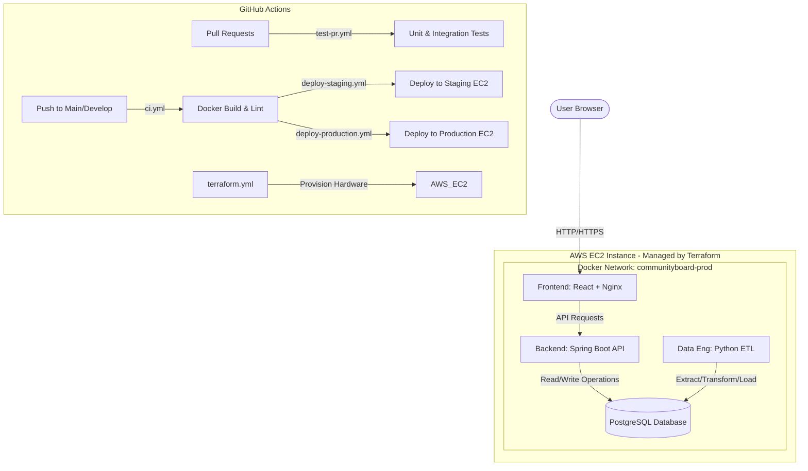
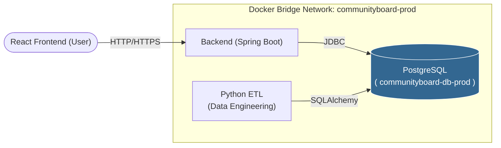

# CommunityBoard
**AmaliTech Group Project – Full-Stack Teams (Teams 1-5)**

A community notice board where users can post announcements, events, and discussions. The application uses a robust microservice architecture deployed on AWS via Docker and Terraform.

---

## 1. Project Overview
The CommunityBoard application is composed of three primary services connected to a single database:
- **Frontend**: A React application served via Nginx, allowing users to interact with the community.
- **Backend**: A Java Spring Boot REST API handling business logic, utilizing Spring Data JPA and HikariCP for connection pooling.
- **Data Engineering**: A Python ETL pipeline (using SQLAlchemy and psycopg2) that extracts data from the database, transforms it for analytics, and loads it back.
- **Database**: A PostgreSQL database. In production, this runs as a Docker container (`communityboard-db-prod`) on an AWS EC2 instance, with data persisted via a Docker volume (`pgdata-prod`).

---

## 2. Architecture Diagram



---

## 3. Repository Structure

Understanding the repository layout is key to navigating the codebase:

```text
/
├── .github/workflows/    # CI/CD Pipelines (Build, Test, Deploy, Terraform)
├── backend/              # Java Spring Boot API source code & Dockerfiles
├── data-engineering/     # Python ETL scripts & analytics logic
├── frontend/             # React SPA source code & Nginx config
├── qa/                   # Automated API (REST Assured) and UI (Selenium) tests
├── scripts/git-hooks/    # Developer safety guardrails (Native Git hooks)
├── terraform/            # Infrastructure as Code (Staging & Production AWS configs)
├── docker-compose.yml             # Local development environment setup
├── docker-compose.staging.yml     # Staging environment topology
├── docker-compose.production.yml  # Production environment topology
├── Makefile              # Essential automation commands (e.g., make test, make init-hooks)
└── README.md             # This comprehensive guide
```

---

## 4. Developer Setup Guide

Welcome to the team! Follow these steps to get your local environment running in under 5 minutes.

1. **Clone the Repository**
   ```bash
   git clone https://github.com/valensniyonkuru/Team1_Repository.git
   cd Team1_Repository
   ```

2. **Install Git Pre-Commit Hooks (Mandatory)**
   We use native Git hooks to prevent bad commits (e.g., committing to `main`, leaking secrets).
   ```bash
   make init-hooks
   ```

3. **Configure Environment Variables**
   Copy the example environment files to configure your local setup.
   ```bash
   cp .env.staging.example .env
   # Open .env and adjust values if necessary
   ```

4. **Start the Local Environment**
   Launch the entire stack using Docker Compose:
   ```bash
   docker-compose up --build -d
   ```

5. **Verify the Services**
   - **Frontend:** http://13.60.89.185:3000/
   - **Backend API Docs:** http://13.60.89.185:8080/swagger-ui/index.html
   - **Database Logs:** `docker-compose logs -f postgres`

---

## 5. Environment Variables

To run the application, the following database environment variables must be defined in your `.env` file (and are required in GitHub Secrets for production):

| Variable | Description | Example (Local) |
|----------|-------------|-----------------|
| `DB_HOST` | Database hostname. Locally or in Docker, use the service name. | `postgres` (or `localhost` outside Docker) |
| `DB_PORT` | Port PostgreSQL is listening on. | `5432` |
| `DB_NAME` | Name of the application database. | `communityboard` |
| `DB_USER` | PostgreSQL active user. | `postgres` |
| `DB_PASSWORD` | PostgreSQL password. **Never hardcode this in source files.** | `your-secure-password` |

*Note: For local development using `docker-compose up`, these are often defaulted inside the `docker-compose.yml` file, but relying on a `.env` file ensures consistency with staging/production.*

---

## 6. Local Development Workflow

- **Run the full stack locally:** Use `docker-compose up -d`. This boots the DB, Backend, Frontend, and ETL tools in interconnected containers.
- **Stop the stack:** `docker-compose down`
- **Test Backend only:**
  Navigate to the `backend/` directory:
  ```bash
  cd backend/
  mvn clean test
  ```
- **Develop Frontend locally (Outside Docker for Hot-Reload):**
  ```bash
  cd frontend/
  npm install
  npm start
  ```
- **Run the ETL Pipeline manually:**
  ```bash
  docker-compose exec etl python etl_pipeline.py
  ```

---

## 7. Git Workflow & Branching Model

We follow a strict **Feature Branch Workflow** utilizing `develop` for Staging and `main` for Production. 

### The Step-by-Step Developer Flow:

**Step 1 – Clone repository**
Ensure you have cloned the project and run `make init-hooks`.

**Step 2 – Create feature branch**
Always branch off the `develop` branch for new features.
```bash
git checkout develop
git pull origin develop
git checkout -b feature/your-feature-name
```

**Step 3 – Implement feature**
Write your code, test locally using `docker-compose up`, and make meaningful commits. The pre-commit hook will validate your code for secrets and file sizes.
```bash
git commit -m "feat: adding new community guidelines page"
```

**Step 4 – Push branch**
Push your changes to GitHub.
```bash
git push origin feature/your-feature-name
```

**Step 5 – Create Pull Request**
Open a Pull Request on GitHub.
- **Base branch:** `develop`
- **Compare branch:** `feature/your-feature-name`

### What happens next?
- **CI Pipeline Runs:** Automatic tests are executed (`test-pr.yml`).
- **Code Review:** Peers review your code.
- **Merge into Develop:** Your PR is approved and merged into `develop`.
- **Staging Deployment:** Merging into `develop` automatically triggers `deploy-staging.yml` which updates the staging server.

### The `develop` → `main` Workflow (Production Release)
Once community testing on Staging is complete and stable:
1. Create a PR from `develop` -> `main`.
2. The CI pipeline validates the PR again.
3. Upon merging to `main`, `deploy-production.yml` automatically builds and pushes the live code to the Production AWS EC2 server.

### Visual Git Workflow Diagram

```text
 Developer
    │
    ▼
 Feature Branch
    │
    ▼
 Pull Request → develop (Base branch)
    │
    ▼
 CI Pipeline (Tests & Security)
    │
    ▼
 Deploy to Staging (Automatic via `deploy-staging.yml`)
    │
    ▼
 PR develop → main
    │
    ▼
 CI Pipeline (Validation)
    │
    ▼
 Deploy to Production (Automatic via `deploy-production.yml`)
```

---

## 8. CI/CD Pipeline Explanation

Our `.github/workflows/` directory automates our DevOps lifecycle:

- **`test-pr.yml`**: Runs immediately when a Pull Request is opened. It executes unit tests for Java and React, and runs security vulnerability scanners (e.g., Trivy). A PR cannot be merged if this fails.
- **`ci.yml`**: Triggers on pushes to `main` or `develop`. It compiles the applications, runs integration tests against a temporary database, and verifies that the Docker images build successfully.
- **`terraform.yml`**: Monitors the `terraform/` directory. If infrastructure code changes, it automatically plans and applies the updates to our AWS environments.
- **`deploy-staging.yml`**: Triggers when code merges into `develop`. It logs into the AWS Staging EC2, pulls the latest images, and restarts the environment for QA testing.
- **`deploy-production.yml`**: Triggers when code merges into `main`. It builds production-optimized Docker images, pushes them to Docker Hub, securely connects to the Production EC2, deploys the stack, and creates a GitHub Release.

---

## 9. Database Setup and Architecture

The database requires strict management to keep our application fast and users' data safe. 

### How It Works on the Server
- PostgreSQL runs completely inside a Docker container (`communityboard-db-prod`).
- **It is NOT publicly exposed.** AWS Security Groups and Docker block external access to port `5432`.
- Only the backend and ETL containers can access it internally through the Docker network.

### Database Access Diagram



### Connection Configuration
The ETL and Backend services dynamically discover the database using Docker networking. They read an environment variable where the host points to the container name:
- `DB_HOST=postgres`
- `DB_PORT=5432`

### Safety Rules 🔒
- **Never expose the PostgreSQL port to the public internet!**
- **Never store database passwords in the codebase!**
- **Always use environment variables (`.env`) for configuration.**
- **Always use Pull Requests before merging features into `develop` or `main`.**

---

## 10. Accessing the Production Server (For DevOps / Maintainers)

While GitHub Actions automates deployment, DevOps engineers or maintainers might occasionally need manual access for checking logs or debugging container issues.

**Production Server Details:**
- **Instance Name:** `production-app-instance`
- **Public IP:** `http://13.60.89.185:3000/`

### 1. Connect via SSH
Ensure you have the private deployment key locally.
```bash
ssh -i deploy_key ubuntu@13.60.89.185:3000
```

### 2. Verify Running Containers
Verify that all the production services (backend, frontend, postgres, etl) are running efficiently.
```bash
docker ps
```

### 3. Check Live Application Logs
If a deployment fails or users report an error, tail the live production logs.
```bash
# Check all logs
docker-compose -f docker-compose.production.yml logs -f

# Check only backend logs
docker-compose -f docker-compose.production.yml logs -f backend
```

### 4. Interact with the Database Container directly
If you need to verify database tables or check migrations:
```bash
docker exec -it communityboard-db-prod psql -U postgres -d communityboard
```

---

## 11. Troubleshooting

**1. "Connection Refused" when starting the backend locally:**
*Cause:* The database container is still booting up and isn't ready.
*Fix:* The `docker-compose.yml` has health checks built-in, but occasionally the backend boots too fast. Just wait 10 seconds and the backend will reconnect, or manually restart it: `docker-compose restart backend`

**2. Pre-commit hook blocks my commit with "Potential hardcoded secret":**
*Cause:* You typed a word like "password=" or "secret=" in your code.
*Fix:* Remove the hardcoded secret and use `System.getenv("VARIABLE")` or `process.env.VARIABLE` instead. Rely on your `.env` file.

**3. "Unauthorized / CORS error" when logging in via frontend:**
*Cause:* The backend `CorsConfig.java` strictly validates origin URLs. 
*Fix:* Ensure you are accessing the frontend from exactly `http://localhost:3000`. If deploying to a new domain, update the allowed origins in the Spring Boot configuration.

**4. Migrations/Tables missing in production:**
*Cause:* `SPRING_JPA_HIBERNATE_DDL_AUTO` might be stuck on `validate`.
*Fix:* Ensure it is set to `update` for initial deployments so Hibernate automatically generates your SQL tables.
